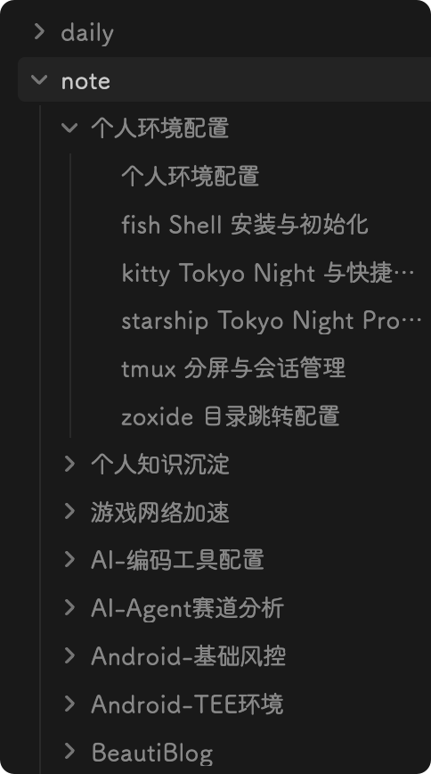

# Knowledge Save

将 AI 会话中的关键进展自动沉淀到 Obsidian 知识库的 Agent Skill。

每天和 AI 聊了那么多，结论、方案、踩过的坑……关掉窗口就忘了。**knowledge-save** 让你在会话有关键进展时，随时将内容整理成结构化笔记，自动写入 Obsidian，并维护好文档之间的双向关联。

本项目提供一个可直接调用的 `knowledge-save` skill，用于将 AI 会话中的关键进展整理进 Obsidian 知识库。


## 效果

下面分别展示知识库项目结构示例和 Graph View 关联图谱：

| 项目结构示例 | 关联图谱 |
|------|------|
|  |  |

## 可以做什么

- **知识不再丢失** — AI 帮你整理的方案、结论、排查过程，都会留在知识库里
- **自动归属判断** — AI 扫描现有知识库结构，自动匹配最合适的主题和子文档
- **优先更新，避免泛滥** — 话题相近时更新已有文档，而非每次都新建
- **关联关系自动维护** — 主题中心页、领域索引、每日索引的双向链接自动保持同步
- **自动复盘总结** — 通过 daily 时间索引，可以按天回顾你和 AI 讨论了什么
- **持续文档沉淀** — 同一主题的多次对话会累积到同一份文档，越用越厚
- **结构化检索** — 时间、领域、主题三个维度任意切入，配合 Obsidian 搜索和 Graph View 快速定位


## 一键安装

将以下提示词发送给你使用的 AI 客户端，让它按安装文档自动完成安装：

```text
请阅读 https://github.com/Zzzia/knowledge-save-skill/blob/main/install.md 中的安装指引，
将 knowledge-save skill 安装到全局配置中。
我的 Obsidian 目录路径是：<你的 Obsidian 绝对路径>
```

AI 会按安装文档完成下载、路径替换、Obsidian 配置和文件安装。

> 详细的手动安装步骤和各平台差异说明见 [install.md](install.md)。

## 使用

安装完成并重启客户端后，你可以通过两种方式使用它。

### 手动调用 `/knowledge-save`

直接调用即可，AI 会根据当前会话上下文自动总结并沉淀，不需要额外参数。

```text
/knowledge-save
```

如果你想指定这次沉淀的重点，也可以在后面补一句方向说明：

```text
/knowledge-save 重点记录这次关于缓存优化的讨论过程和最终方案
```

### 全局 `AGENTS.md` 中配置自动记录

推荐把规则写进全局 `AGENTS.md`，让 AI 在出现关键进展时自动调用 `knowledge-save` 进行沉淀。

例如：

```text
在有关键进展时，自动使用 knowledge-save 将关键信息沉淀到我的 Obsidian 知识库。
```

## License

MIT
