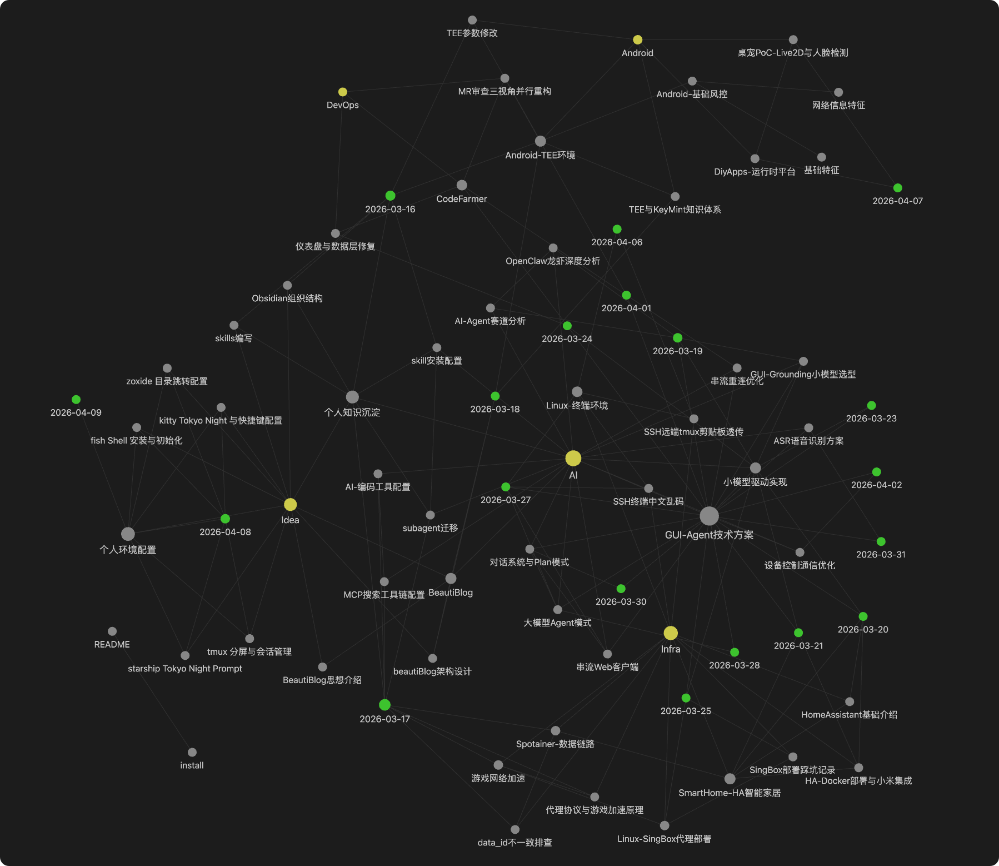

# Knowledge Save

将 AI 会话中的关键进展自动沉淀到 Obsidian 知识库的 Agent Skill。

每天和 AI 聊了那么多，结论、方案、踩过的坑……关掉窗口就忘了。**knowledge-save** 让你在会话有关键进展时，随时将内容整理成结构化笔记，自动写入 Obsidian，并维护好文档之间的双向关联。

## 快速导航

- [项目介绍](#项目介绍)
- [快速预览](#快速预览)
- [快速安装](#快速安装)
- [使用](#使用)
- [效果](#效果)
- [核心特性](#核心特性)
- [知识库结构](#知识库结构)
- [为什么用 Obsidian](#为什么用-obsidian)
- [文件说明](#文件说明)

## 快速预览

- 安装源目录：`runtime/knowledge-save/`
- 依赖：[`obsidian-skills`](https://github.com/kepano/obsidian-skills) 中的 `obsidian-markdown`
- 显式调用：`/knowledge-save`
- 推荐方式：在全局 `AGENTS.md` 中配置“出现关键进展时自动记录”
- 详细安装说明：见 [install.md](install.md)

## 快速安装

将以下提示词发送给你使用的 AI 客户端，让它按安装文档自动完成安装：

```text
请阅读 https://github.com/Zzzia/knowledge-save-skill/blob/main/install.md 中的安装指引，
将 knowledge-save skill 安装到全局配置中。
我的 Obsidian 目录路径是：<你的 Obsidian 绝对路径>
```

AI 会按安装文档完成下载、路径替换、Obsidian 配置和文件安装。

> 详细的手动安装步骤和各平台差异说明见 [install.md](install.md)。

## 使用

安装完成并重启客户端后，你可以通过两种方式使用它。

### 方式一：显式调用 `/knowledge-save`

```text
/knowledge-save
```

也可以带方向指定：

```text
/knowledge-save 重点记录这次关于缓存优化的讨论过程和最终方案
```

### 方式二：在全局 `AGENTS.md` 中配置自动记录

推荐把规则写进全局 `AGENTS.md`，让 AI 在出现关键进展时自动调用 `knowledge-save` 进行沉淀。

例如：

```text
在有关键进展时，自动使用 knowledge-save 将关键信息沉淀到我的 Obsidian 知识库。
```

## 项目介绍

本项目提供一个可直接调用的 `knowledge-save` skill，用于将 AI 会话中的关键进展整理进 Obsidian 知识库。

安装时使用 `runtime/knowledge-save/` 目录中的运行时文件，并同时安装 [obsidian-skills](https://github.com/kepano/obsidian-skills) 依赖。

## 效果

knowledge-save 沉淀的笔记会自动形成双向链接网络，在 Graph View 中呈现这样的关联图谱：



## 核心特性

- **自动归属判断** — AI 扫描现有知识库结构，自动匹配最合适的主题和子文档
- **优先更新，避免泛滥** — 话题相近时更新已有文档，而非每次都新建
- **关联关系自动维护** — 主题中心页、领域索引、每日索引的双向链接自动保持同步
- **跨平台通用** — 适配 OpenCode、Claude Code、Gemini CLI、Codex、Cursor 等 AI 客户端

## 你能得到什么

- **知识不再丢失** — AI 帮你整理的方案、结论、排查过程，都会留在知识库里
- **自动复盘总结** — 通过 daily 时间索引，可以按天回顾你和 AI 讨论了什么
- **持续文档沉淀** — 同一主题的多次对话会累积到同一份文档，越用越厚
- **跨项目知识复用** — 全局安装后，在任何项目中沉淀的知识都汇入同一个知识库
- **结构化检索** — 时间、领域、主题三个维度任意切入，配合 Obsidian 搜索和 Graph View 快速定位

## 知识库结构

采用 **daily + topic + note** 三层架构：

```text
obsidian-dir/
├── daily/                          # 每日索引（时间维度入口）
│   └── 2025-07-01.md
├── topic/                          # 领域索引（领域维度入口）
│   ├── Backend.md
│   └── DevOps.md
└── note/                           # 主题笔记（内容载体）
    └── Redis-缓存优化/
        ├── Redis-缓存优化.md       # 主题中心页（索引 + 关联）
        └── 热点Key治理.md          # 具体笔记页（实际内容）
```

| 层级 | 作用 |
|------|------|
| **daily** | 每日沟通纪要索引，记录时间线，关联当天涉及的文档 |
| **topic** | 大领域聚合页（如 Backend、DevOps、Frontend），汇总该领域下所有主题入口 |
| **note** | 按主题分目录，每个主题有一个中心页做索引，下挂具体笔记页 |

三层之间通过 wikilink 双向关联，可以从任意维度（时间/领域/主题）切入检索。

## 为什么用 Obsidian

- **本地 Markdown** — 数据完全在你手里，纯文本文件，不被任何平台绑定
- **双向链接** — `[[wikilink]]` 让笔记之间互相引用，从任意一篇都能跳到关联内容
- **Graph View** — 可视化知识关联图谱，一眼看清主题间的关系和脉络
- **Backlinks** — 自动追踪"谁引用了这篇笔记"，不用手动维护反向链接
- **插件生态** — 丰富的社区插件，可以进一步扩展搜索、数据查询、模板等能力

## 文件说明

| 文件 | 说明 |
|------|------|
| `runtime/knowledge-save/SKILL.md` | 核心 skill 定义，包含完整的文档模板、工作流程和约束规则 |
| `install.md` | 详细安装指引，说明如何安装运行时 skill、配置 Vault 路径，以及接入 `obsidian-skills` 依赖 |

## License

MIT
